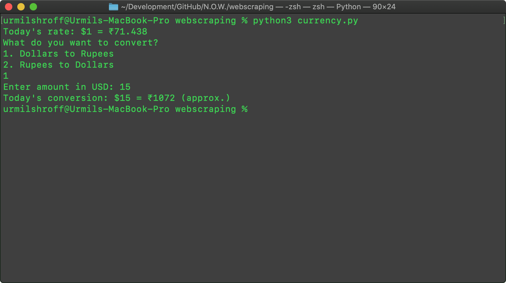
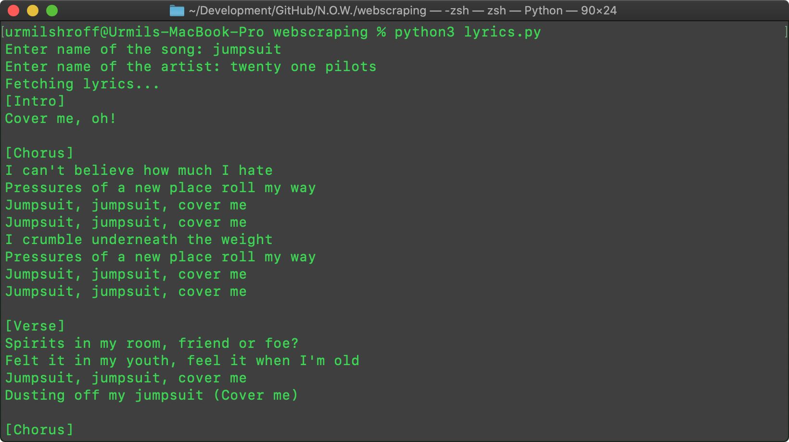
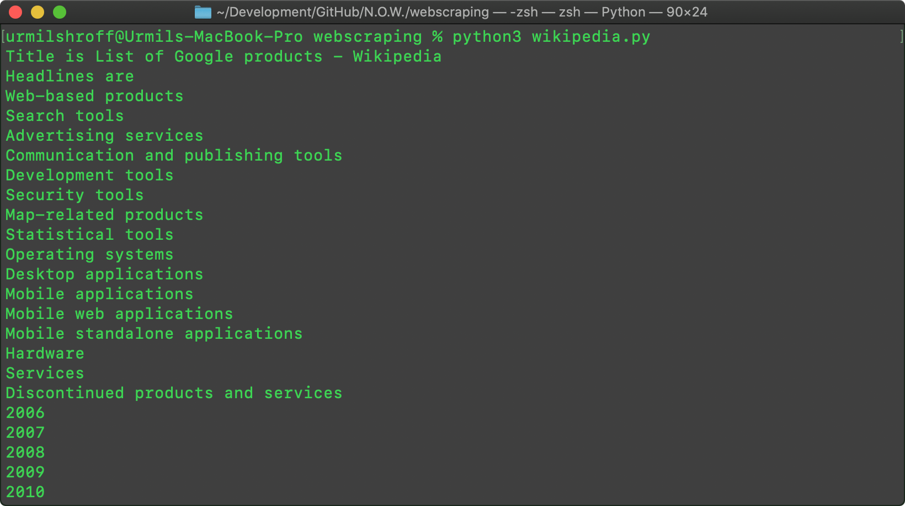

# Webscraping

Simple Python 3 programs to scrape information from different sites using BeautifulSoup4. This repository is for students of N.O.W. Mozilla Club's Webscraping Workshop.

## Screenshots

Currency converter:

Song lyrics finder:

Wikipedia scraper:

